<div align="center">

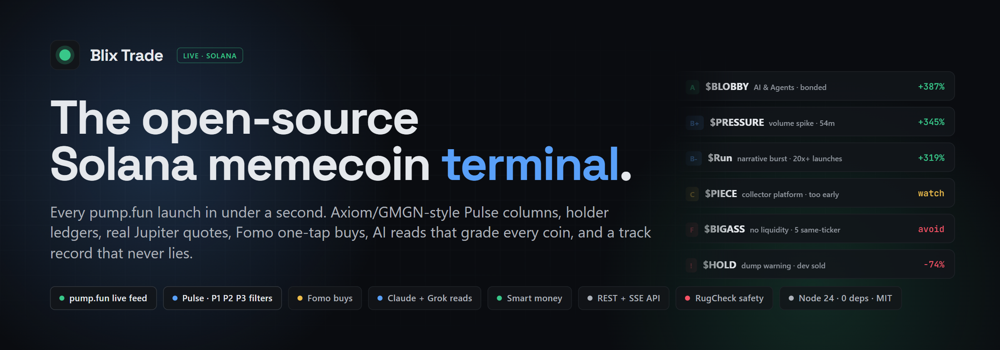

# Blix Trade

**The open-source Solana memecoin trading terminal.**
Axiom / GMGN-style Pulse, live pump.fun feed, holder ledgers, real Jupiter quotes, Fomo one-tap buys, AI reads on every coin, smart-money tracking, and a track record that scores its own calls. Runs on your machine. Zero dependencies. MIT.

[](https://solana.com)
[](https://pump.fun)
[](https://nodejs.org)
[](package.json)
[](https://github.com/blixvip/blixtrade/actions/workflows/test.yml)
[](LICENSE)
[](CONTRIBUTING.md)
[](https://github.com/blixvip/blixtrade/stargazers)

[**Quick start**](#quick-start) · [**Screenshots**](#screenshots) · [**Features**](#what-you-get) · [**vs Axiom / GMGN / Photon**](#how-it-compares) · [**API**](#api) · [**Architecture**](#architecture) · [**Docs**](docs/) · [**Contributing**](CONTRIBUTING.md)

</div>

---

## Why Blix

Every serious memecoin terminal on Solana is closed source, hosted by someone else, and paid for with a cut of your trades. Blix is the opposite:

- **Open source, local-first.** One `npm start`, no account, no fee on anything. Your data lives in a SQLite file on your disk.
- **The Pulse you already know.** New pairs → Final stretch → Migrated → Running now, with per-column P1 / P2 / P3 filters, keyboard navigation, sound, and a one-key paper desk. If you have used Axiom or GMGN you already know how to drive it.
- **Whole-market coverage.** Every pump.fun launch arrives live over PumpPortal in under a second (~1,800 launches/hour), plus DexScreener profiles and boosts and GeckoTerminal new and trending pools.
- **AI that reads every coin, not just a chatbot.** Claude Haiku triages each launch in seconds; strong ones get a deep read from Claude Sonnet or Grok 4.7 with live X search. Grade A–F, thesis, ceiling, catalysts, risks, entry and exit plan.
- **Honest by construction.** Every signal is re-priced at 15m / 1h / 6h / 24h and shown as a count over the number actually checked. Emptied pools count as 0x. Losses are shown as loudly as wins.
- **Safety first.** RugCheck on every coin, dev-sold and liquidity-pulled warnings, serial-launcher detection, bundle and sniper tagging in the holder ledger. A coin that fails safety never gets a positive alert.
- **Trade where you already trade.** Buy on Fomo deep links on every coin, paper fills at real Jupiter quotes with slippage, DexScreener / pump.fun / RugCheck / X one click away.

> Blix watches, grades, alerts and paper-trades. **It never signs a transaction and never touches your keys.**

## Screenshots

<p align="center">
  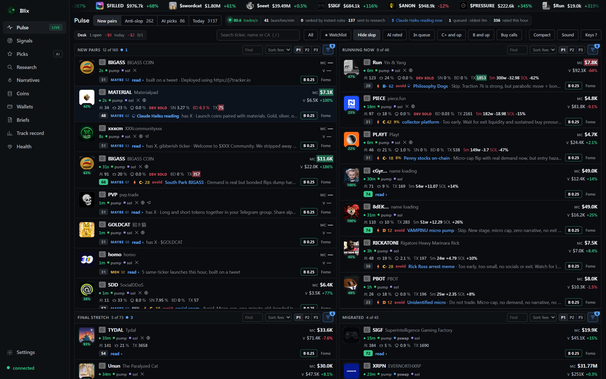
  <br><sub><b>Pulse</b>: New pairs, Final stretch, Migrated and Running now, each with its own filters. Every card shows age, holders, top-10 share, bundle %, dev sold, tx count, 5-minute flow in SOL, the AI's grade and one-line verdict, and a Buy button.</sub>
</p>

<p align="center">
  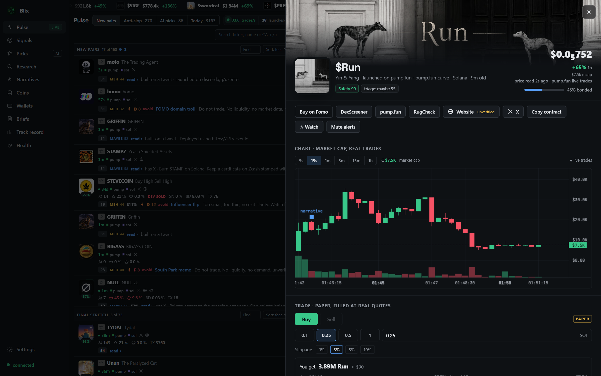
  <br><sub><b>Coin sheet</b>: 5s to 1h market-cap candles built from real trades, narrative markers, safety and triage scores, Fomo / DexScreener / pump.fun / RugCheck / X links, and a trade panel quoted by Jupiter.</sub>
</p>

| | |
|:--:|:--:|
| 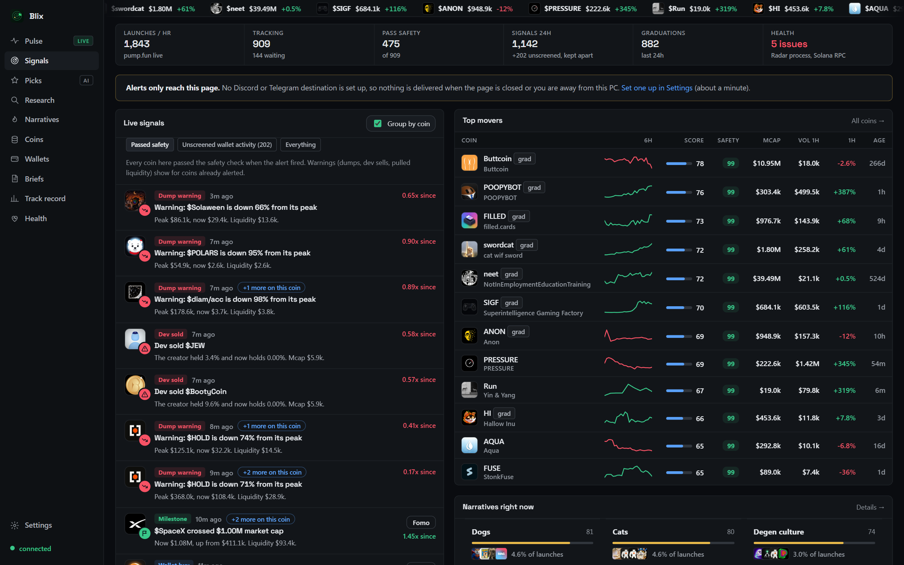 <br><sub><b>Signals</b>: dump warnings, dev sells, milestones, wallet buys, top movers with sparklines</sub> | 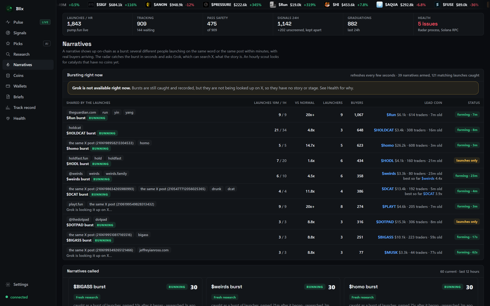 <br><sub><b>Narratives</b>: bursts of launches on the same word or X post caught in seconds, graded by Grok</sub> |
| 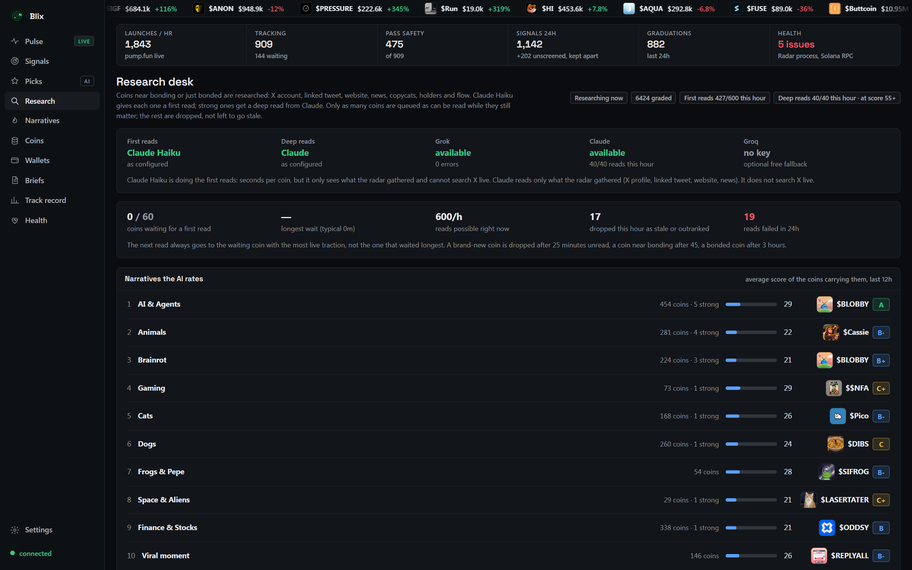 <br><sub><b>Research desk</b>: 600 first reads an hour, deep reads on the strongest, narratives ranked by the AI</sub> | 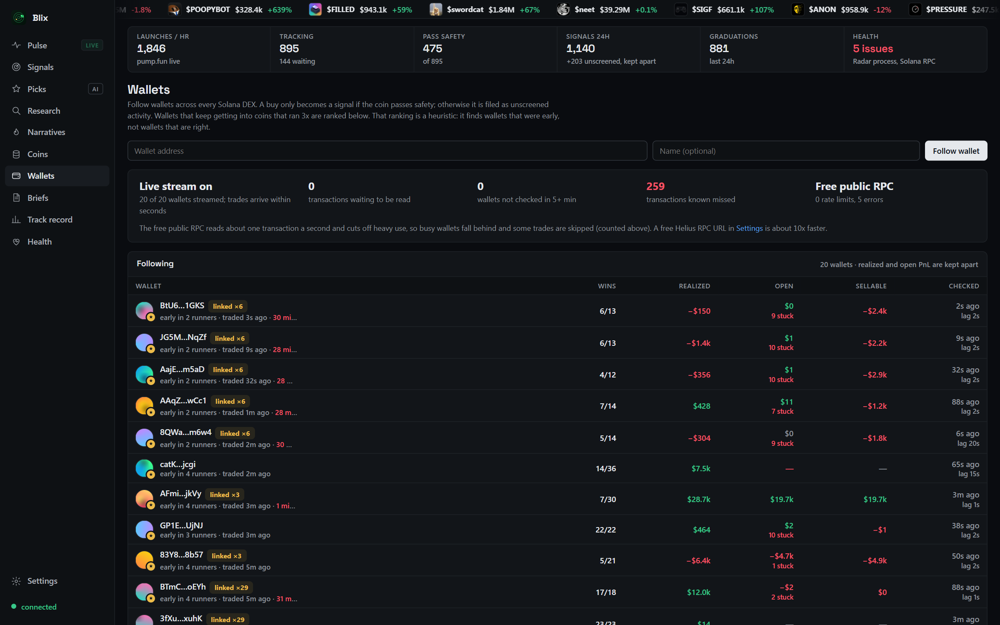 <br><sub><b>Wallets</b>: follow any wallet across every Solana DEX, realized vs open vs sellable PnL, smart-money ranking</sub> |
| 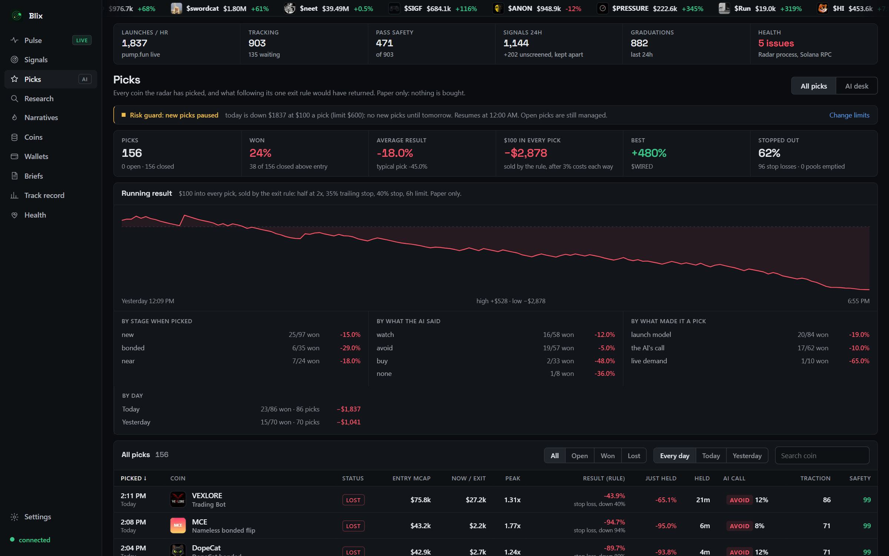 <br><sub><b>Picks</b>: every AI pick paper-traded by one exit rule, scored by stage, call and reason, with a daily risk guard</sub> | 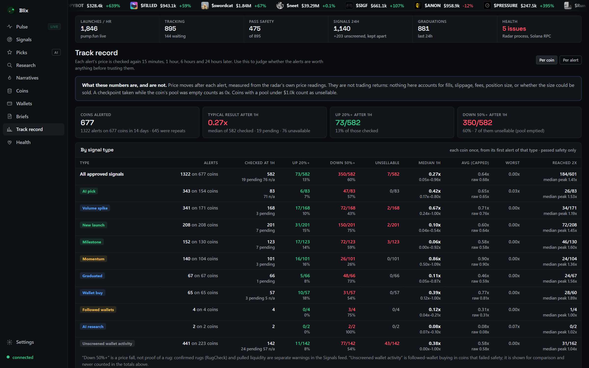 <br><sub><b>Track record</b>: every signal type re-priced at 1h, median, up-20 % and down-50 % rates, nothing hidden</sub> |
| 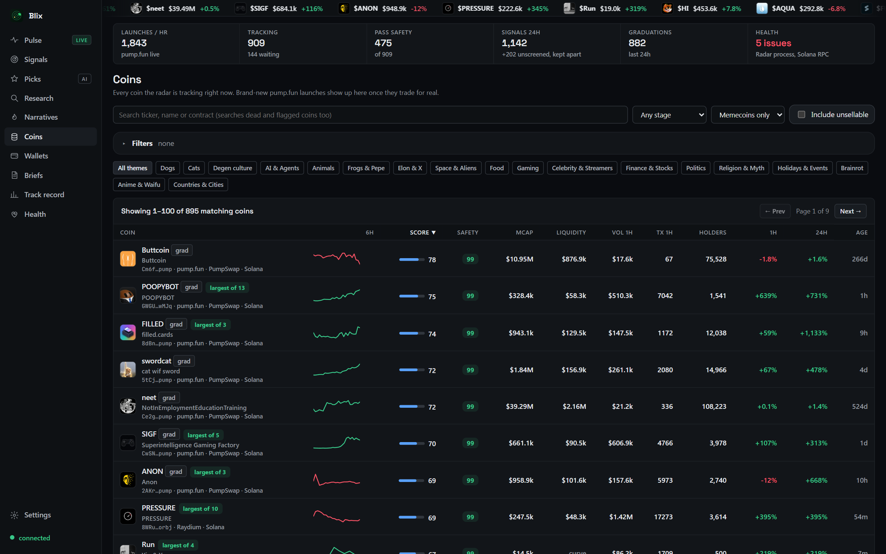 <br><sub><b>Coins</b>: everything tracked, sortable, with safety and score</sub> | 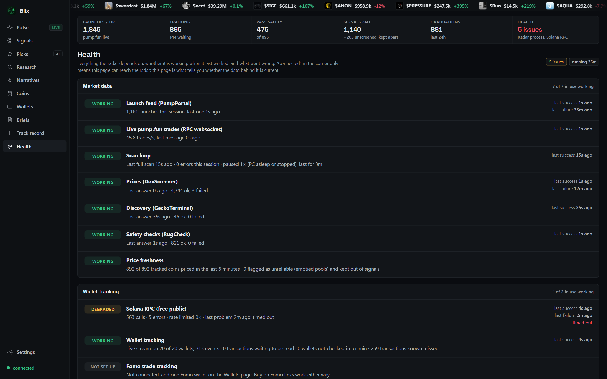 <br><sub><b>Health</b>: last success and last failure for every feed, RPC, AI and alert channel</sub> |

## What you get

| Area | What Blix does |
|---|---|
| **Pulse** | Four live columns (New pairs, Final stretch, Migrated, Running now). Per-column P1/P2/P3 filter presets, Anti-slop filter, AI-rated / In-queue / C+ / B+ / Buy-calls quick filters, compact mode, sound, hotkeys (`?`), ticker tape of the day's winners. |
| **Live feed** | PumpPortal websocket for every pump.fun launch and trade, DexScreener profiles + boosts, GeckoTerminal new + trending pools. Real trades per second shown live in the status bar. |
| **Coin sheet** | Market-cap candles (5s · 15s · 1m · 5m · 15m · 1h) built from real trades, volume bars, narrative markers, bonding progress, live holder ledger (dev / sniper / bundle tags), dev's other launches, insider networks, socials with verification. |
| **Safety** | RugCheck report per coin (mint/freeze authority, LP lock, concentration), sellable-liquidity check, believable-price check, serial-launcher detection (4+ coins in 6h), dev-sold and liquidity-pulled warnings. One policy gates every positive signal. |
| **Trading** | Paper desk filled at **real Jupiter quotes** with slippage, presets (0.1 / 0.25 / 0.5 / 1 SOL), take-profit ladder, trailing and hard stops, time stops, per-day risk guard. **Buy on Fomo** deep link on every coin (opens the Fomo app, Fomo pays your fees). |
| **AI reads** | Claude Haiku first read in seconds. Deep reads by Claude Sonnet 5.5 or Grok 4.7 with up to 10 live X / web searches. Grade A–F, thesis, ceiling, catalysts, risks, buy / watch / avoid with conviction and an exit plan. Self-review rewrites its own playbook from the scorecard. |
| **Narratives** | Theme detection on every launch (AI, dogs, cats, politics, brainrot…). Burst detection: several launchers on the same word or the same X post within minutes. Grok looks the burst up on X and names the story. Hourly scout for catalysts that have no coin yet. |
| **Wallets** | Follow any wallet; swaps on every Solana DEX read from chain. Realized, open and *sellable* PnL kept apart. Linked-wallet clustering. Smart-money discovery from early buyers of 3x+ runners, auto-follow. Fomo trader ranking and "Fomo crowd buying" alerts. |
| **Alerts** | Desktop, Discord webhook, Telegram bot. Per-type toggles, quiet hours, per-coin cooldown, mute per coin or wallet. Every delivery is logged. |
| **Track record** | Every signal re-priced at 15m / 1h / 6h / 24h plus 24h peak. Per-type median, up-20 %, down-50 %, unsellable count, reached-2x. Per coin or per alert. |
| **Briefs** | Hourly market brief written by Claude from the radar's own data. "Ask Claude about this coin" anywhere. |
| **Remote** | Optional Cloudflare quick tunnel + Worker so your phone can open the same terminal, gated by a key. |
| **Ops** | Supervisor auto-restarts, daily SQLite backups, export / import, health page with last-success / last-failure for every dependency. |

## How it compares

Feature check as of October 2026. "Hosted" terminals change fast; corrections welcome in an issue.

| | **Blix** | Axiom | GMGN | Photon | BullX |
|---|:--:|:--:|:--:|:--:|:--:|
| Open source | **✓ MIT** | – | – | – | – |
| Runs on your own machine, your data stays local | **✓** | – | – | – | – |
| Trading fee | **0 %** (paper desk; executes via Fomo) | ~1 % | ~1 % | ~1 % | ~1 % |
| Pulse-style multi-column new / bonding / migrated | ✓ | ✓ | ✓ | ✓ | ✓ |
| Live pump.fun launch feed, sub-second | ✓ | ✓ | ✓ | ✓ | ✓ |
| Holder ledger with dev / sniper / bundle tags | ✓ | ✓ | ✓ | ✓ | ✓ |
| Candles from real trades, 5s resolution | ✓ | ✓ | ✓ | ✓ | ✓ |
| AI grade + written thesis on every coin | **✓** | – | partial | – | – |
| Narrative burst detection with live X lookup | **✓** | – | – | – | – |
| Public, audited track record of its own calls | **✓** | – | – | – | – |
| Smart-money discovery from chain, no paid tier | **✓** | paid | paid | – | paid |
| Real quotes (Jupiter) in the trade panel | ✓ | ✓ | ✓ | ✓ | ✓ |
| Discord + Telegram alerts you fully control | **✓** | partial | ✓ | – | ✓ |
| REST + SSE API for your own bots | **✓** | – | partial | – | – |
| Hackable: add a column, a filter, a model | **✓** | – | – | – | – |

## Quick start

Requirements: **Node 24+**. No native modules, no package install.

```bash
git clone https://github.com/blixvip/blixtrade.git
cd blixtrade
npm start
# → http://localhost:4420
```

On Windows, double-click **Start Blix.vbs** to run it hidden with the supervisor (auto-restart, starts collecting data in the background). `bin/open.mjs` opens the dashboard window.

Everything below is optional and configured on the **Settings** page:

| Add | Why | Cost |
|---|---|---|
| **Helius RPC URL** | ~10x faster wallet tracking; the free public RPC reads ~1 tx/s | free tier |
| **Discord webhook / Telegram bot** | alerts reach you when the page is closed | free |
| **Claude Code login** (`claude` CLI on this PC) | briefs, deep reads, "Ask Claude" | your Claude plan |
| **Grok CLI login** (`~/.grok/auth.json`) | fast reads with live X search, narrative scout, picks | SuperGrok |
| **Groq API key** | free fallback model when Grok is paused | free |
| **Fomo wallet** | see what Fomo traders buy, Fomo crowd alerts | free |

Run a second isolated copy: `RADAR_DATA=<folder> RADAR_PORT=<port> npm start`.

Tests: `npm test` (Node's built-in runner, 30 tests, no network).

## Integrations

Blix is built on public, mostly free infrastructure. No key is required to start.

| Layer | Services |
|---|---|
| Chain | [Solana](https://solana.com) mainnet RPC + websocket · [Helius](https://helius.dev) (optional) |
| Launches & trades | [pump.fun](https://pump.fun) via [PumpPortal](https://pumpportal.fun) websocket · pump.fun metadata and images (IPFS / Pinata) |
| Markets | [DexScreener](https://dexscreener.com) · [GeckoTerminal](https://geckoterminal.com) · [Jupiter](https://jup.ag) quotes |
| Safety | [RugCheck](https://rugcheck.xyz) |
| Execution | [Fomo](https://fomo.family) deep links (fee-sponsored mobile trading) · [fomowalletfinder.com](https://fomowalletfinder.com) |
| AI | [Claude](https://claude.com) (Haiku 4.5, Sonnet 5.5) via Claude Code login or API key · [Grok](https://x.ai) 4.6 / 4.7 via Grok CLI login · [Groq](https://groq.com) Llama 3.x fallback |
| Social | X / FxTwitter for profile and tweet reads · Google News |
| Alerts | [Discord](https://discord.com/developers/docs/resources/webhook) webhooks · [Telegram](https://core.telegram.org/bots) bots · desktop notifications |
| Remote | [Cloudflare Workers](https://workers.cloudflare.com) + quick tunnel (`worker/`) |

## Pipeline

```
 pump.fun ──PumpPortal ws──┐
 DexScreener profiles ─────┤   Discover      every launch, ~1/s; tracked once it trades for real
 GeckoTerminal pools ──────┘       │
                                   ▼
                              Enrich         price, mcap, liq, vol, buys/sells every 30s (hot) / 2m
                                   │
                                   ▼
                              Safety         RugCheck · sellable pool · believable price · serial dev
                                   │
                    ┌──────────────┼──────────────────┐
                    ▼              ▼                  ▼
                 Score        Narratives          Holders
               0–100 ×      bursts, themes,     dev/sniper/bundle,
               safety       X lookup (Grok)     insider networks
                    │              │                  │
                    └──────────────┼──────────────────┘
                                   ▼
                              Signals        launch · graduation · volume spike · momentum · milestone · dump · dev sold · wallet buy
                                   │
                                   ▼
                        Research desk (AI)   Claude Haiku first read → Claude Sonnet / Grok 4.7 deep read → grade A–F, thesis, plan
                                   │
                                   ▼
                              Picks          buy / watch / avoid · paper-traded by one exit rule · self-review rewrites the playbook
                                   │
                                   ▼
                          Track record       15m · 1h · 6h · 24h · peak, per type, per coin, emptied pools = 0x
```

The full stage-by-stage write-up, with every threshold, lives in [docs/HOW-IT-WORKS.md](docs/HOW-IT-WORKS.md).

## API

Blix is a plain HTTP + Server-Sent-Events server on `localhost:4420`. Everything the UI shows is available as JSON, so you can build bots, Discord cogs or your own front end on top. Full reference: [docs/API.md](docs/API.md).

```bash
# live stream: launches, signals, trades, migrations, paper fills, briefs
curl -N http://localhost:4420/api/stream

# the four Pulse columns
curl http://localhost:4420/api/pulse

# a coin's live holder ledger and real-trade candles
curl http://localhost:4420/api/holders/<mint>?top=25
curl http://localhost:4420/api/candles/<mint>?tf=15s

# a real Jupiter quote
curl "http://localhost:4420/api/quote?mint=<mint>&side=buy&amount=0.25&slip=300"

# queue a coin for an AI read, then fetch it
curl -X POST http://localhost:4420/api/research/<mint>
curl http://localhost:4420/api/research/<mint>

# paper desk, filled at the real quote
curl -X POST http://localhost:4420/api/paper/quoted -H 'content-type: application/json' -d '{"mint":"<mint>","sol":0.25}'
```

| Endpoint | Returns |
|---|---|
| `GET /api/stream` | SSE: `launch` `signal` `live` `mig` `pic` `paper` `brief` `tick` |
| `GET /api/pulse` · `/api/bot` | Pulse columns · anti-slop, day, scout, early-launch model |
| `GET /api/tokens` · `/api/signals` · `/api/overview` | coins table, signals feed, KPIs |
| `GET /api/holders/:mint` · `/api/candles/:mint` · `/api/quote` | holder ledger, candles, Jupiter quote |
| `GET /api/token/:mint` · `/explain` · `POST /classify` | coin detail, Claude explanation, manual theme / asset class |
| `GET\|POST /api/research/:mint` · `GET /api/research` · `/api/triage` | AI reads, desk status, triage record |
| `GET /api/picks` · `/api/picks/all` · `POST /review` · `POST /scout` | picks scorecard, ledger, self-review, narrative scout |
| `GET\|POST /api/paper` · `/api/paper/quoted` · `/:id/sell` `/sellq` `/rule` `/preview` | paper desk |
| `GET\|POST /api/wallets` · `GET\|POST\|DELETE /api/wallet/:address` · `POST /api/fomo/trader` · `GET /api/fomo` | wallets, smart money, Fomo flow |
| `GET /api/narratives` · `/api/clusters` · `/api/briefs` · `POST /api/brief` | themes, bursts, briefs |
| `GET /api/perf` · `/api/health` · `/api/events` | track record, health, event log |
| `GET\|POST /api/settings` · `/api/alerts` · `/api/export` · `POST /api/import` · `/api/backup` · `/api/repair` | configuration and ops |

## Architecture

Vanilla Node 24 ESM, Node's built-in SQLite, no framework, no bundler, no dependencies. ~12.5k lines.

```
server/
  server.js      HTTP + SSE, routing, remote-key gate, brief schedule
  engine.js      discovery, enrichment, safety, scoring, signals, outcomes
  sources.js     PumpPortal, DexScreener, GeckoTerminal, RugCheck clients
  livetrades.js  per-second trade tape from the pump.fun stream
  pulse.js       the four Pulse columns, filters, anti-slop
  candles.js     market-cap candles from real trades (5s → 1h)
  quote.js       Jupiter quotes with slippage
  paper.js       paper desk: fills, exit rules, risk guard
  holders.js     live holder ledger, dev / sniper / bundle tags
  clusters.js    narrative bursts (same word, same X post)
  narratives.js  themes, heat, emerging words
  early.js       early-launch model
  triage.js      first-read gate
  fast.js        Claude Haiku / Groq fast reads
  grok.js        Grok CLI transport (OAuth, circuit breaker, spend cap)
  research.js    research desk: queue, gathering, deep reads, grades
  brain.js       picks, exit rules, scorecard, self-review, narrative scout
  ai.js          Claude briefs and explanations
  wallets.js     follow, PnL, smart money
  solana.js      RPC pacing, swap parsing
  fomo.js        Fomo links, fee-payer learning, Fomo trade flow
  quality.js     trust rules: sellable prices, asset classes, honest stats
  rules.js       alert rules (mute, quiet hours, cooldown)
  notify.js      Discord, Telegram
  health.js      last success / last failure per dependency
  tunnel.js      Cloudflare quick tunnel + Worker registration
  db.js · settings.js · images.js · tape.js · coverage.js
public/
  index.html · app.js · trade.js · styles.css · tokens.css · trade.css
worker/          Cloudflare Worker that fronts the tunnel (trade.<yourdomain>)
bin/             supervise.mjs (auto-restart) · open.mjs (open the window) · replay.mjs (backtest exit rules on recorded tapes) · grok-bench.mjs
test/            radar.test.mjs (npm test)
data/            SQLite db, settings, logs, backups (git-ignored)
design.md        the locked design system every page reads from
```

## What you can and cannot trust

Blix is opinionated about honesty. The short version; the full list is in [docs/HOW-IT-WORKS.md](docs/HOW-IT-WORKS.md#what-you-can-and-cannot-trust).

- Every alert type goes through **one safety policy**. A followed-wallet buy in a coin that fails is stored as *unscreened activity* and never pushed.
- Prices from **emptied pools are quarantined**. They never feed peaks, multiples, charts, winners or narratives.
- The track record is **price moves, not profit**: no fills, slippage, fees or size. It leads with the median and shows every rate as a count over the number actually checked.
- "Down 50 %" is a dump. *RugCheck: rugged* and *Liquidity pulled* are separate, specific warnings.
- Wallet PnL is **split**: realized, open at quoted prices, and what could plausibly be sold.
- "Early wallets" is a heuristic. Wallets that buy the same coins within two minutes of each other are treated as one actor.
- AI output is **labelled with what wrote it**, when, and from which sources.

## Security and privacy

- Listens on **localhost only**, rejects requests from other origins and hostnames, strict CSP.
- Saved webhook URLs, bot tokens and keys are **never sent back to the page**.
- No wallet connection, no private keys, no transaction signing. Execution happens in the Fomo app on your phone.
- Remote access is opt-in: a Cloudflare quick tunnel fronted by `worker/`, gated by a per-install key kept in an HttpOnly cookie.

Report vulnerabilities per [SECURITY.md](SECURITY.md).

## Roadmap

- [ ] Wallet-connect execution (Jupiter swap) behind an explicit opt-in
- [ ] Multi-chain feeds (Base, BSC) behind the same safety policy
- [ ] Pluggable AI providers through a single interface (OpenAI-compatible endpoints)
- [ ] Docker image and one-line VPS install
- [ ] Shareable, signed track-record exports
- [ ] Mobile layout for the Pulse

Open an issue to vote or add to it.

## Contributing

PRs and issues welcome. Read [CONTRIBUTING.md](CONTRIBUTING.md) and [design.md](design.md) (the locked design system) first. `npm test` must pass; new data sources must go through the safety policy in `server/quality.js`.

## License

[MIT](LICENSE) © 2026 blixvip.

**Not financial advice.** Memecoins are extremely risky. Blix shows you data and an AI's opinion of it; what you do with that is yours. Nothing here is a recommendation to buy or sell anything.
